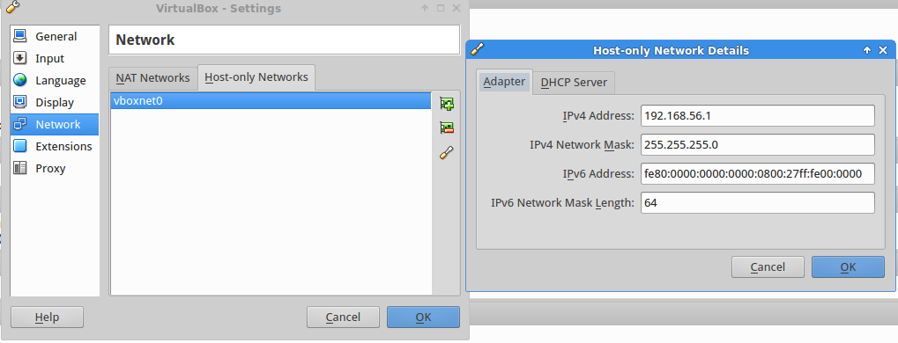
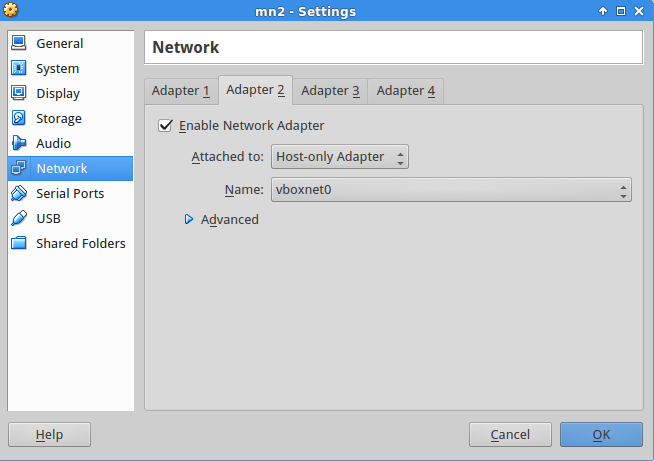

<!-- markdown-toc start - Don't edit this section. Run M-x markdown-toc/generate-toc again -->
**Table of Contents**

- [Configuration](#configuration)
    - [General](#general)
        - [Required software](#required-software)
        - [Clustering Mininet Hosts](#clustering-mininet-hosts)
    - [For VBox VMs Environment](#for-vbox-vms-environment)
        - [Guest](#guest)
            - [VBox networking](#vbox-networking)
            - [~/.ssh/config](#sshconfig)
            - [Vbox usefull commands](#vbox-usefull-commands)
        - [VMs](#vms)
            - [/etc/network/interfaces](#etcnetworkinterfaces)
            - [/etc/hosts](#etchosts)
            - [/etc/hostname](#etchostname)
        - [/etc/ssh/sshd_config](#etcsshsshdconfig)
            - [route -n](#route--n)
            - [ip addr show](#ip-addr-show)
- [Metrics](#metrics)
    - [Handling packet_in message](#handling-packetin-message)
        - [Collecting metrics](#collecting-metrics)
        - [Parsing metrics](#parsing-metrics)
        - [whitebox metrics](#whitebox-metrics)
        - [Blackbox](#blackbox)
- [Pair logs](#pair-logs)
- [Running loom_switch](#running-loom_switch)
- [loom_switch customizations](#loom_switch-customizations)
- [References](#references)

<!-- markdown-toc end -->


# Configuration

## General

### Required software

1. Mininet (tag 2.2.0)
2. [mininet-setup](https://github.com/mentels/mininet-setup)
3. [pair](https://github.com/mentels/pair)
4. loom_switch
5. OVS (2.0.2)
6. Erlang (17.4 /usr/lib/erlang/releases/17/OTP_VERSION)

### Clustering Mininet Hosts

https://github.com/mininet/mininet/wiki/Cluster-Edition-Prototype

./clustersetup.sh -p clusterhost1 clusterhost2

## For VBox VMs Environment

### Guest

#### VBox networking

Host-only network adapter has to be configured like this:


The first adapter of the VM, that will be connected to the same LAN as the
host computer for providing Internet connectivity, has to be configured like this:


The second adapter, that is for host-only networking (connections with
other vms or services running on the host OS), has to be configured like this:


> If you clone VMs remember to change MAC addresses in case you're using
> DHCP.

#### ~/.ssh/config

```bash
Host mn1 # change for the other vm
HostName 192.168.56.110 # change for the other vm
ForwardX11 yes
User mininet
```

#### Vbox usefull commands

```bash
vboxmanage controlvm <uuid|name> <cmd>
vboxmanage list runningvms
VBoxHeadless --startvm <uuid|name>
vboxmanage midifyvm --name <name> # renames
vboxmanage startvm fc-mn --type headless
vboxmanage controlvm NAME pause/resume
```

### VMs

#### /etc/network/interfaces

```bash

auto eth1
iface eth1 inet dhcp
up route add default gw 10.152.0.1 eth1 # for internet connectivity

auto eth0
iface eth0 inet static
address 192.168.56.110 # use 111 for the next host and so on
netmask 255.255.255.0
```

#### /etc/hosts

```bash
127.0.0.1       localhost mn1
192.168.56.111  mn2
```

#### /etc/hostname

```bash
mn1
```

### /etc/ssh/sshd_config

```bash
PermitTunel yes
```

#### route -n

```bash
mininet@mn1:~$ route -n
Kernel IP routing table
Destination     Gateway         Genmask         Flags Metric Ref    Use Iface
0.0.0.0         10.152.0.1      0.0.0.0         UG    0      0        0 eth1
10.152.0.0      0.0.0.0         255.255.255.0   U     0      0        0 eth1
192.168.56.0    0.0.0.0         255.255.255.0   U     0      0        0 eth0
```

#### ip addr show

```bash
mininet@mn1:~$ ip addr show
1: lo: <LOOPBACK,UP,LOWER_UP> mtu 65536 qdisc noqueue state UNKNOWN group default 
    link/loopback 00:00:00:00:00:00 brd 00:00:00:00:00:00
    inet 127.0.0.1/8 scope host lo
       valid_lft forever preferred_lft forever
2: eth0: <BROADCAST,MULTICAST,UP,LOWER_UP> mtu 1500 qdisc pfifo_fast state UP group default qlen 1000
    link/ether 08:00:27:4f:0f:f4 brd ff:ff:ff:ff:ff:ff
    inet 192.168.56.110/24 brd 192.168.56.255 scope global eth0
       valid_lft forever preferred_lft forever
3: eth1: <BROADCAST,MULTICAST,UP,LOWER_UP> mtu 1500 qdisc pfifo_fast state UP group default qlen 1000
    link/ether 08:00:27:69:64:1f brd ff:ff:ff:ff:ff:ff
    inet 10.152.0.34/24 brd 10.152.0.255 scope global eth1
       valid_lft forever preferred_lft forever
```


# Metrics

## Handling packet_in message

### Collecting metrics

Metrics are collected using Exometer and are saved as
[histogram](https://github.com/Feuerlabs/exometer_core/blob/master/doc/exometer_histogram.md).
It's configured as follows:
```erlang
ok = exometer:new([handle_packet_in], histogram, [{time_span, 5000}]),
```
By default, exometer uses `exomter_slot_slide` backend which aggregates
mean, min and max values within given time slots instead of saving all
elements. It can be configured by `slot_period` option (in miliseconds).
`{time_span, 5000}` is a size of the sliding window, which indicates
that when reading a metric one will get values for the previous 5000 ms.

The metrics are read on a regular basis by an exometer lager reporter:

```erlang
ok = exometer_report:add_reporter(exometer_report_lager, []),
ok = exometer_report:subscribe(
    exometer_report_lager, [handle_packet_in], [mean], 5200),
```

The `[one, count]` indicates that `mean` of values in the sliding window
will be read (in fact it will be avereage over values for time slots).

### Parsing metrics

The metrics are outputed as logs by the `exometer_report_lager` with
`notice` log level. Example log for `handle_packet_in` mean metric
looks like this:

```shell
2015-04-07 15:13:16.193 [notice] <0.133.0> exometer_report_lager: handle_packet_in_mean:882
```

Note the `_mean` suffix added to the metrics' name.

`scripts/exo_lager_to_gnuplot` is a parser for metrics' logs. It retrieves
metrics from the log file, compute time in which the value was measured
and output this time and value(s) to a file. For example for the
`handle_packet_in` metric the script outputs a line with two values
TIME MEAN for each metric's log to the `handle_packet_in.metrics`.


### whitebox metrics

Timestamp is made when packet_in message reaches the controller, just after
it is parsed (snippet from of_driver/of_driver_connection):

```erlang
handle_messages([Message|Rest], NewState) ->
    ?DEBUG("Receive from ~p: ~p~n", [NewState#?STATE.address, Message]),
    ls_metrics:handle_packet_in(NewState#?STATE.datapath_mac, Message),
    case handle_message(Message, NewState) of
        {stop, Reason, State} ->
            {stop, Reason, State};
        NextState ->
            handle_messages(Rest, NextState)
    end.
```

In the ls_metrics:handle_packet_in/2 call timestamp is made and rememberd
based on the Switch Datapath Mac, message Xid and packet_in BufferId.

The time is measured when correspoding of_packet_out is sent from a controller:
just after the packet is encoded an before it is sent to the socket
(another snippet from of_driver/of_driver_connection_erl):

```erlang
do_send(Msg, #?STATE{protocol = Protocol,
                     socket = Socket,
                      address = IpAddr,
                      datapath_mac = DatapathMac} = _State) ->
    ls_metrics:handle_packet_out(DatapathMac,Msg),
    case of_protocol:encode(Msg) of
        {ok, EncodedMessage} ->
            ?DEBUG("Send to ~p: ~p~n", [IpAddr, Msg]),
            of_driver_utils:send(Protocol, Socket, EncodedMessage);
        {error, Error} ->
            {error, Error}
    end.
```

### Blackbox

In blackbox measuring we assume that the app developer has no access to
the underlying OpenFlow controller and measures times on message ingress
and egrees on his/her application.

Timestamp is made when packet in reaches `ls_logic` before sending it
to a process:

```erlang
handle_packet_in(DatapathId, {Xid, PacketIn}) ->
    exometer:update([packet_in], 1),
    gen_server:cast(?SERVER,
                    {handle_packet_in, DatapathId, Xid, PacketIn, erlang:now()}).
```

The time difference is measured when a corresponding flow_mod and the
packet_out messages are sent:

```erlang
handle_cast({handle_packet_in, DatapathId, Xid, PacketIn, Now0},
            #state{switches = Switches0} = State) ->
    FwdTable0 = maps:get(DatapathId, Switches0),
    FwdTable1  = learn_src_mac_to_port(DatapathId, PacketIn, FwdTable0),
    OutPort = case get_port_for_dst_mac(PacketIn, FwdTable0) of
                  undefined ->
                      flood;
                  PortNo ->
                      install_flow_to_dst_mac(PacketIn, PortNo, DatapathId),
                      lager:debug([{ls, x}], "[~p][flow] Sent flow mod", [DatapathId]),
                      PortNo
    end,
    send_packet_out(DatapathId, Xid, PacketIn, OutPort),
    update_handle_packet_in_metric(Now0),
    lager:debug([{ls, x}], "[~p][pkt_out] Sent packet out through port: ~p~n", [DatapathId,
                                                                                OutPort]),
    Switches1 = maps:update(DatapathId, FwdTable1, Switches0),
    {noreply, State#state{switches = Switches1}};
```

# Pair logs

The `mininet-setup` creates `pair` directories for logs and configuration.
They are created on each host in the mininet cluster according to the scheme:

* logs
  `~pair/files/{TIMESTAMP}/log/{MININET_HOST_NAME}-{PAIR_NO}-{STATE}.log`
* configs
  `~pair/files/{TIMESTAMP}/config/{MININET_HOST_NAME}-{PAIR_NO}-{STATE}.config`

The `mininet-setup` relies on the logs in the following aspects:

* it checks whether passive parts of pairs started grepping for 'pair started'

* it check whether pairs finished grepping for the 'Finished'

# Running loom_switch

The `loom_switch` application is to be run by [ls_runner](https://github.com/mentels/ls_runner)
application.

It communicates with the `mininet-setup` and starts/stops the swtich logic
when requested.

The protocol is illustreated below (MNS - `mininet-setup`; LSR - `ls_runner`):

1. Beofre test
```
   MNS ----- prepare/{RUN_ID} ----> LSR
   MNS <----- ready ---- LSR
```
   * it is sent before MNS starts the test
   * before sending the `ready` response LSR is expected to start the switch
and delete `log/notice.log` file that has the metrics

2. After test
```
   MNS ----- stop/{RUN_ID} ----> LSR
   MNS <----- stopped ---- LSR
```
   * it is sent after the test is completed
   * LSR is expected to stop the switch and copy the `log/notice.log` to
`log/{RUN_ID}/notice.log` file.

# loom_switch customizations

Following customizations are available

* modes: either regular or process per switch
  In the `regular` mode each switch is handled in the same process; in the
  `proc_per_switch` mode there's a gen_server started for each switch meaning
  that they're handled asynchronously.
* idle/hard timeouts for flow mods
* number of [online schedulers](http://erlang.org/doc/man/erl.html#+S)

From sys.config:

```erlang
[{ls, [
       %% {mode, proc_per_switch},
       {logic_opts, [{idle_timeout, 10},
                     {hard_timeout, 30}]},
       {schedulers, default},
       {mode, regular}
      ]},
```

# References

* [Mininet VM images](https://github.com/mininet/mininet/wiki/Mininet-VM-Images)
* [Mininet Cluster Edittion](https://github.com/mininet/mininet/wiki/Cluster-Edition-Prototype#run)
* [Mininet EC2](https://github.com/mininet/mininet/wiki/Environment-Setup)
